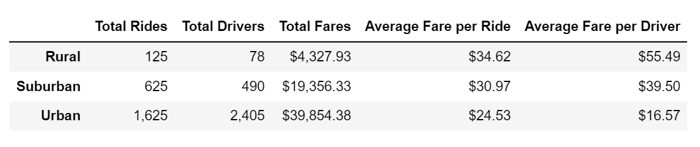
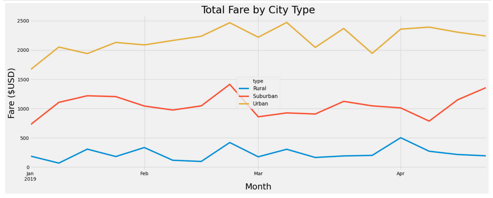

# PyBer_Analysis

## Overview
The purpose of this analysis was to create a timelined visual analysis of 
data from a ride-sharing company (PyBer). The end result was creating a 
summary line chart of the total weekly fares by each city type. 

## Results

Based on the PyBer summary DataFrame

	* Urban cities have the highest rider and driver count while rural cities have the least. 
	
	* The total fares decreases as the size of the city type decreases. 
	
	* The Average fare per ride and per driver is highest in rural cities and lowest in urban cities. 

## Summary

To adress the disparities among city types and boost ridership in all cities, PyBer can: decrease the 
prices in fare per ride in rural and suburban cities to make ride-sharing more affordable to riders and 
increase the amount of drivers in rural and suburban cities.
